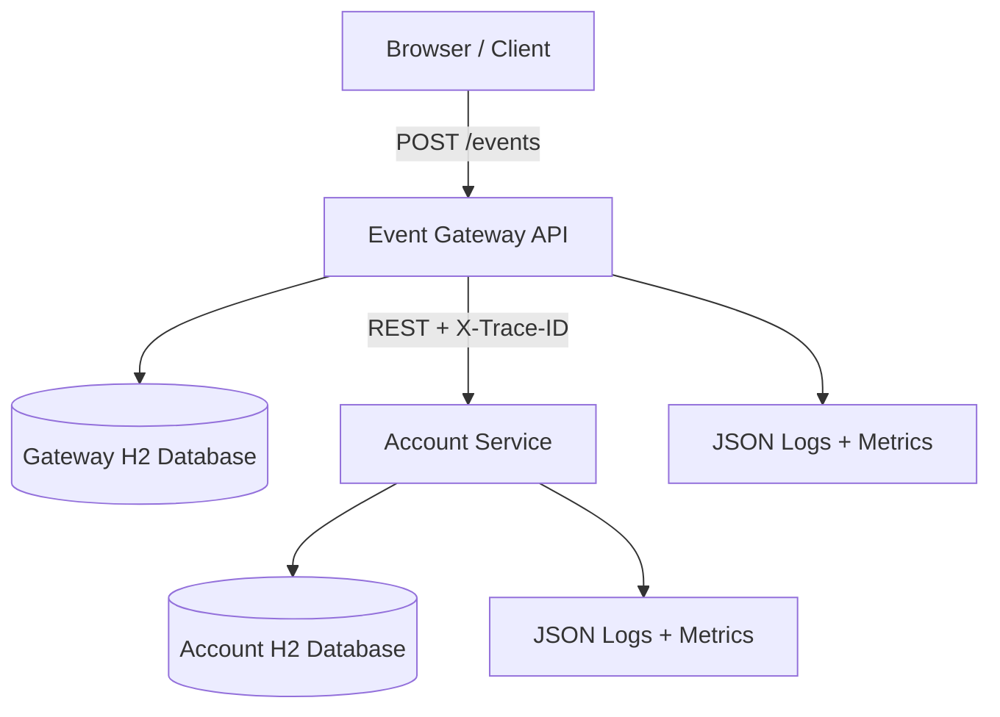

# Event Ledger

Event Ledger is a two-microservice Spring Boot system for processing financial transaction events. It demonstrates idempotent event ingestion, out-of-order event handling, service separation, trace propagation, structured logging, metrics, resiliency, Docker Compose, and automated testing.

## Architecture



### Event Gateway API

Public-facing service on port `8080`.

Responsibilities:

- Validate incoming transaction events
- Enforce idempotency using `eventId`
- Store local event records in Gateway H2 database
- Call Account Service synchronously using REST
- Propagate `X-Trace-ID`
- Expose health, metrics, and graceful error responses
- Use Retry + Circuit Breaker for Account Service calls

### Account Service

Internal service on port `8081`.

Responsibilities:

- Apply transactions to accounts
- Maintain balances and transaction history in separate H2 database
- Prevent duplicate transaction application using unique `eventId`
- Return account balance and recent transactions
- Log propagated trace IDs

## API Endpoints

### Gateway

| Method | Endpoint | Description |
|---|---|---|
| POST | `/events` | Submit transaction event |
| GET | `/events/{id}` | Get event by ID |
| GET | `/events?account={accountId}` | List account events ordered by event timestamp |
| GET | `/accounts/{accountId}/balance` | Proxy balance query to Account Service |
| GET | `/health` | Service health |
| GET | `/actuator/prometheus` | Prometheus metrics |

### Account Service

| Method | Endpoint | Description |
|---|---|---|
| POST | `/accounts/{accountId}/transactions` | Apply transaction |
| GET | `/accounts/{accountId}/balance` | Get balance |
| GET | `/accounts/{accountId}` | Get account details and recent transactions |
| GET | `/health` | Service health |
| GET | `/actuator/prometheus` | Prometheus metrics |

## Sample Request

```bash
curl -i -X POST http://localhost:8080/events \
  -H 'Content-Type: application/json' \
  -H 'X-Trace-ID: demo-trace-001' \
  -d '{
    "eventId": "evt-001",
    "accountId": "acct-123",
    "type": "CREDIT",
    "amount": 150.00,
    "currency": "USD",
    "eventTimestamp": "2026-05-15T14:02:11Z",
    "metadata": {
      "source": "mainframe-batch",
      "batchId": "B-9042"
    }
  }'
```

Duplicate submission with the same `eventId` returns the already stored event and does not apply the balance again.

## Resiliency Pattern Choice

The Gateway uses **Retry + Circuit Breaker** on the Gateway → Account Service call.

Why this choice:

- Retry handles short transient failures.
- Exponential backoff prevents aggressive retry storms.
- Circuit breaker stops repeated calls when the Account Service is unhealthy.
- The client receives a clear `503 Service Unavailable` instead of hanging or receiving a generic `500`.

When Account Service is unavailable:

- `POST /events` returns `503` with a clear error message.
- `GET /events/{id}` still works because event data is local to Gateway.
- `GET /events?account=...` still works because it only uses Gateway database.
- Balance queries return a clear service-unavailable response.

## Observability

Implemented:

- JSON structured logs through Logback encoder
- Trace ID in logs using MDC
- `X-Trace-ID` propagation from Gateway to Account Service
- Health endpoints on both services
- Micrometer counters such as:
  - `gateway.events.created`
  - `gateway.events.duplicate`
  - `account.transactions.applied`
  - `account.transactions.duplicate`
- Prometheus metrics via `/actuator/prometheus`

## Run Locally

Prerequisites:

- Java 17+
- Maven 3.9+

Start Account Service:

```bash
cd account-service
mvn spring-boot:run
```

Start Gateway Service in another terminal:

```bash
cd gateway-service
mvn spring-boot:run
```

## Run with Docker Compose

```bash
docker compose up --build
```

Gateway: `http://localhost:8080`

Account Service: `http://localhost:8081`

## Run Tests

From the root folder:

```bash
mvn clean test
```

Generate JaCoCo coverage reports:

```bash
mvn clean test jacoco:report
```

Coverage reports are generated under:

```text
account-service/target/site/jacoco/index.html
gateway-service/target/site/jacoco/index.html
```

## AI-Assisted SDLC

See [`docs/AI_USAGE.md`](docs/AI_USAGE.md) for how AI was used as a Design Agent, Development Agent, QA Agent, and GitHub Copilot Agent during the SDLC.

Open the repository Agents tab here:

```text
https://github.com/saichandra1324/Charles-Schwab/agents
```

Use the prompts in [`docs/COPILOT_PROMPTS.md`](docs/COPILOT_PROMPTS.md) with **Agents > Create task** to create visible Copilot agent sessions like the GitHub Agents screen.

## AI Design Agent Deliverables

The design-phase AI deliverables are included under `docs/`:

- `docs/DESIGN_AGENT.md` - full design document generated/refined through the Design AI Agent workflow
- `docs/ARCHITECTURE_DIAGRAMS.md` - Mermaid architecture, sequence, tracing, failure, and data model diagrams
- `docs/COPILOT_PROMPTS.md` - GitHub Copilot prompts and agent examples
- `docs/AI_USAGE.md` - explanation of AI-assisted SDLC usage


## AI Agent Deliverables

This repository includes documentation showing how AI-assisted SDLC practices were applied:

- `docs/DESIGN_AGENT.md` - design-agent workflow and design decisions
- `docs/ARCHITECTURE_DIAGRAMS.md` - Mermaid architecture and sequence diagrams
- `docs/DEVELOPMENT_AGENT.md` - development-agent implementation notes for error handling, logging, auditing, and Git history
- `docs/COPILOT_PROMPTS.md` - GitHub Copilot prompts for design, development, QA, review, and documentation agents
- `.github/copilot-instructions.md` - repository-specific Copilot Agent instructions
- `docs/AI_USAGE.md` - overall AI-assisted SDLC summary

## Auditing

Both services persist audit events in their own H2 databases. The audit trail captures action, event ID, account ID, trace ID, outcome, details, and timestamp.

Gateway audit endpoints:

```bash
curl http://localhost:8080/audit
curl http://localhost:8080/events/evt-001/audit
```

Account Service audit endpoints:

```bash
curl http://localhost:8081/accounts/audit
curl http://localhost:8081/accounts/audit/events/evt-001
```

## QA Agent Deliverables

The QA-phase AI deliverables are included under `docs/`:

- `docs/QA_AGENT.md` - QA Agent workflow, automated test strategy, and prompt examples
- `docs/reports/UNIT_TEST_COVERAGE.md` - unit test inventory and JaCoCo coverage instructions
- `docs/reports/FUNCTIONAL_TEST_COVERAGE.md` - requirement-to-test functional coverage matrix
- `scripts/generate-coverage-reports.sh` - runs tests and copies JaCoCo reports into `docs/reports/unit-coverage`

Run all tests and generate coverage artifacts:

```bash
./scripts/generate-coverage-reports.sh
```

After the script completes, open:

```text
docs/reports/unit-coverage/gateway-service/index.html
docs/reports/unit-coverage/account-service/index.html
```
