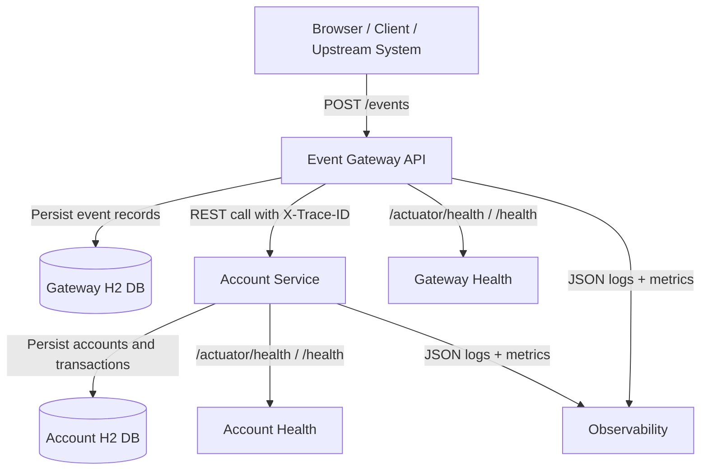
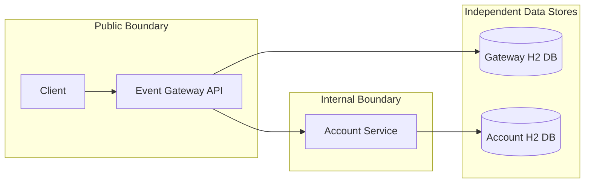
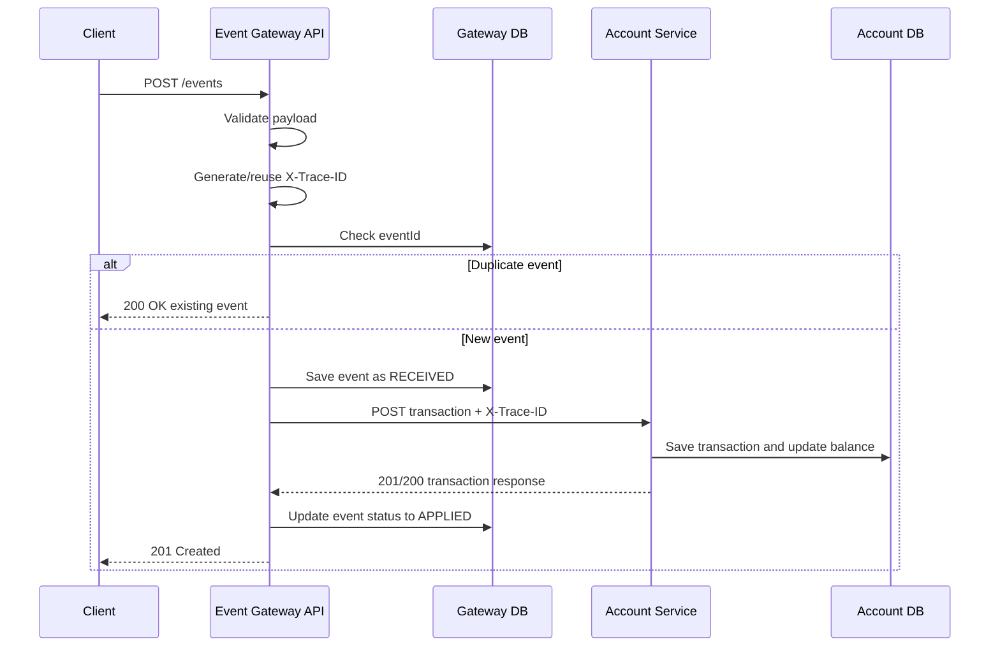
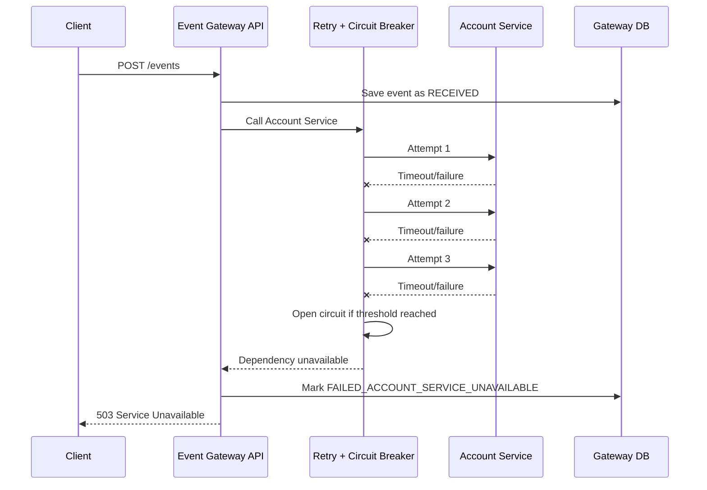
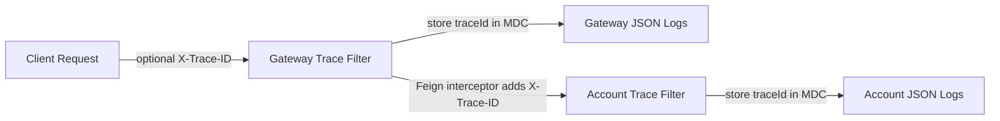
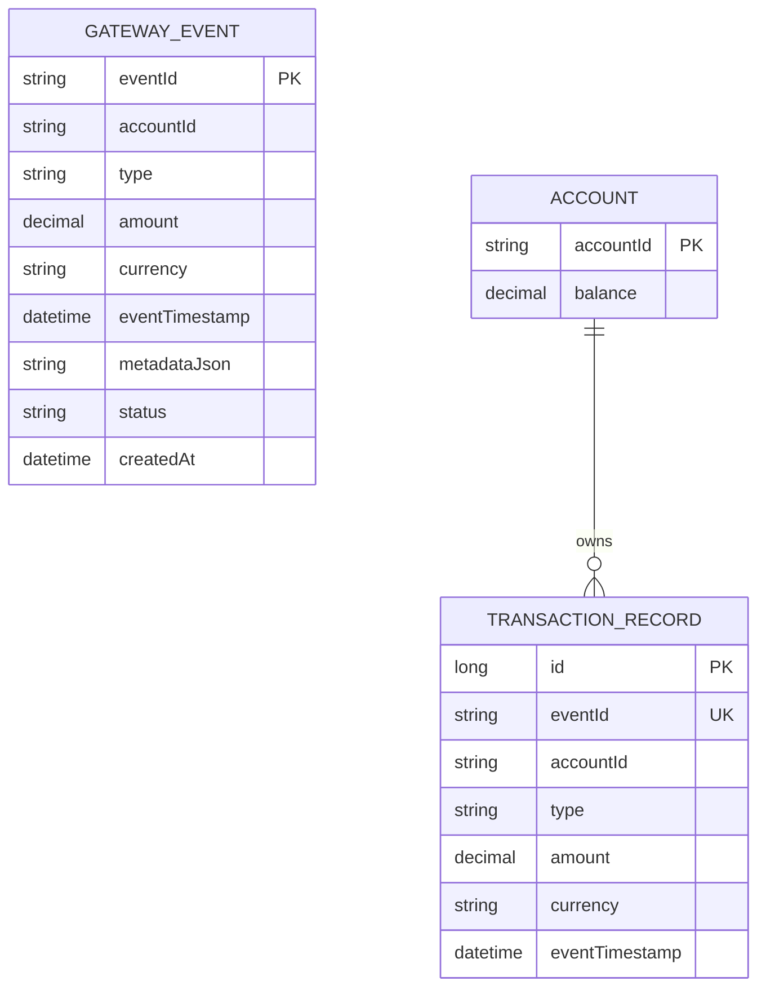

# Architecture and Design Diagrams

## High-Level Architecture

## Service Boundary Diagram

## Event Processing Sequence

## Failure and Circuit Breaker Sequence

## Trace Propagation Diagram

## Data Model Diagram

