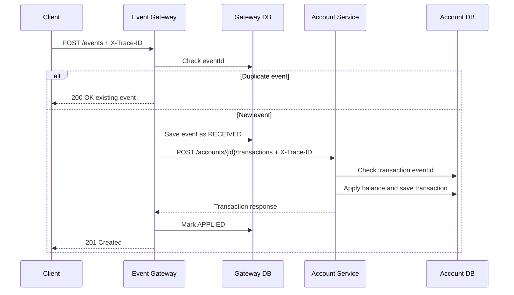

# Event Ledger Design Document

## Goal

Build a small distributed ledger system with two independently runnable microservices. The Gateway receives financial events from upstream clients. The Account Service owns balances and transaction history.

## Key Requirements Addressed

- Idempotent event processing
- Out-of-order event listing
- Correct balance computation
- Service separation with separate H2 databases
- REST communication between services
- Trace propagation through `X-Trace-ID`
- JSON structured logging
- Custom metrics
- Retry + Circuit Breaker resiliency
- Graceful degradation when Account Service is unavailable
- Docker Compose and automated tests

## Service Responsibilities

### Event Gateway API

- Public entry point
- Validates request payloads
- Stores event records locally
- Checks duplicate `eventId` before calling Account Service
- Calls Account Service synchronously
- Converts Account Service failures into `503 Service Unavailable`
- Exposes local event reads even if Account Service is down

### Account Service

- Internal service
- Applies credits and debits
- Maintains account balances
- Stores transaction history
- Uses unique transaction `eventId` to protect against duplicate application

## Data Model

### Gateway `events`

| Field | Purpose |
|---|---|
| eventId | Primary key and idempotency key |
| accountId | Account owning event |
| type | CREDIT or DEBIT |
| amount | Positive amount |
| currency | Currency code |
| eventTimestamp | Original occurrence time |
| metadataJson | Optional metadata |
| status | RECEIVED, APPLIED, or FAILED_ACCOUNT_SERVICE_UNAVAILABLE |
| createdAt | Gateway receipt time |

### Account `account`

| Field | Purpose |
|---|---|
| accountId | Primary key |
| balance | Current net balance |

### Account `transactions`

| Field | Purpose |
|---|---|
| id | Surrogate key |
| eventId | Unique event identifier |
| accountId | Account identifier |
| type | CREDIT or DEBIT |
| amount | Transaction amount |
| currency | Currency |
| eventTimestamp | Original event timestamp |

## Main Flow

## Out-of-Order Handling

Events can arrive in any order. Gateway stores the original `eventTimestamp` and returns account event listings ordered by `eventTimestamp ASC`. Balance is computed as credits minus debits, so arrival order does not change the final balance.

## Trace Propagation

- Gateway checks for incoming `X-Trace-ID`.
- If missing, Gateway generates a UUID trace ID.
- Gateway stores trace ID in MDC for JSON logging.
- Feign interceptor sends the same trace ID to Account Service.
- Account Service reads the header, stores it in MDC, and logs it.

## Resiliency

Gateway uses Resilience4j Retry + Circuit Breaker around the Account Service call.

Configuration:

- Max retry attempts: 3
- Exponential backoff enabled
- Circuit breaker sliding window: 5 calls
- Failure threshold: 50%
- Open-state wait duration: 10 seconds

Fallback behavior: throw a domain-specific `AccountServiceUnavailableException`, mapped to HTTP 503.

## Graceful Degradation

When Account Service is unavailable, Gateway-owned read APIs continue to work:

- `GET /events/{id}`
- `GET /events?account={accountId}`

APIs depending on Account Service return clear `503` errors.

## Testing Strategy

- Unit/service tests for idempotency and balance calculation
- Controller validation tests for invalid payloads
- Failure-path tests for Account Service unavailability
- Trace header test to verify request/response trace behavior
- JaCoCo coverage reports generated by Maven
