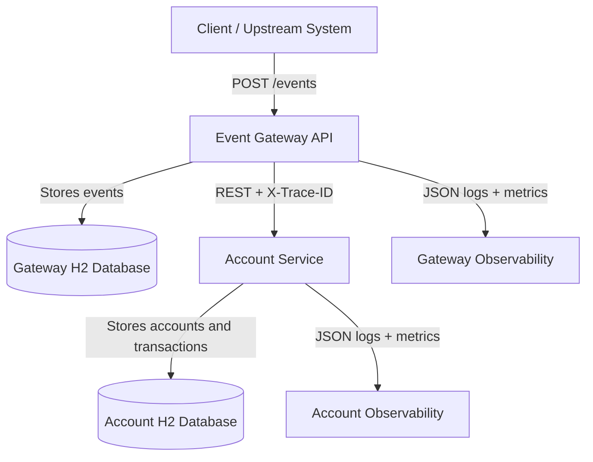
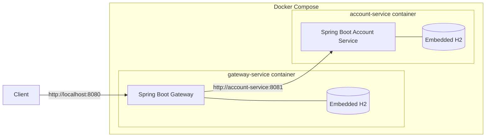
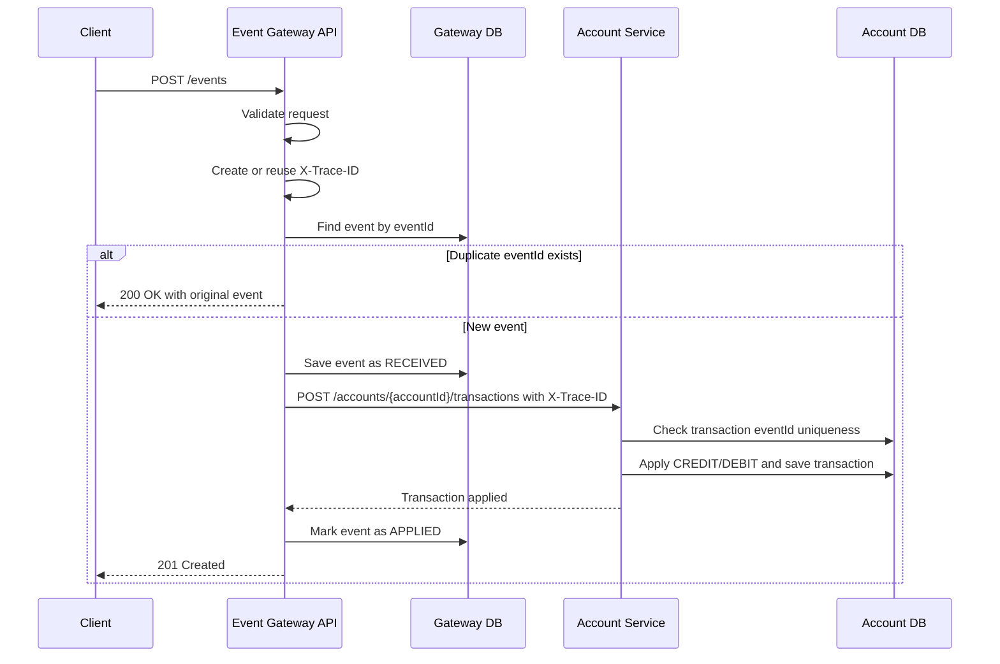
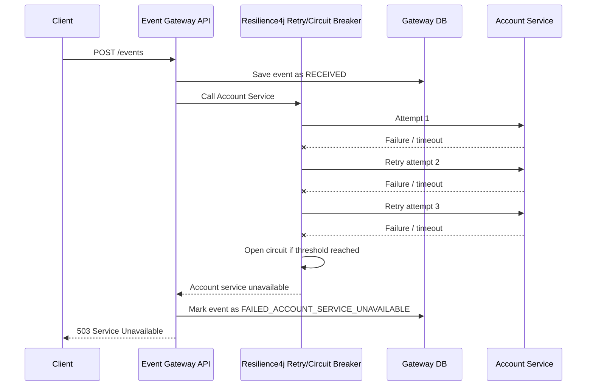

# Design AI Agent Deliverable

## 1. Agent Objective

The Design AI Agent was used to accelerate the architecture and design phase of the Event Ledger assignment. The agent helped convert the business requirements into a technical design that can be implemented, tested, operated, and explained during an interview.

The agent focused on:

- Identifying service boundaries
- Designing REST API contracts
- Defining separate persistence ownership
- Designing idempotency and out-of-order handling
- Defining trace propagation and logging strategy
- Selecting resiliency patterns
- Producing architecture and sequence diagrams
- Calling out failure scenarios and graceful degradation behavior

## 2. Requirement Interpretation

The system must process financial transaction events from upstream systems. Since events may be duplicated and may arrive out of order, the design must protect account balances from duplicate application while still preserving event history in chronological order.

The assignment also requires two independently runnable services with separate embedded databases. Therefore, the Gateway service owns event ingestion and event read APIs, while the Account Service owns balance and transaction state.

## 3. Selected Architecture

The final architecture uses two Spring Boot microservices:

1. **Event Gateway API**
   - Public-facing service
   - Accepts transaction events
   - Validates payloads
   - Enforces idempotency using `eventId`
   - Stores events in its own H2 database
   - Calls Account Service using synchronous REST
   - Propagates `X-Trace-ID`
   - Applies retry and circuit breaker on Account Service calls

2. **Account Service**
   - Internal service
   - Applies credits and debits
   - Maintains account balance
   - Stores account transactions in its own H2 database
   - Protects against duplicate transaction application using unique `eventId`

## 4. System Context Diagram



## 5. Container / Deployment Diagram



## 6. Main Event Processing Sequence



## 7. Account Service Failure Sequence



## 8. Idempotency Design

The Gateway uses `eventId` as the idempotency key.

Processing logic:

1. Client submits event.
2. Gateway checks whether `eventId` already exists.
3. If it exists, Gateway returns the existing event and does not call Account Service again.
4. If it does not exist, Gateway saves the event and calls Account Service.

The Account Service also has a unique constraint on transaction `eventId`. This provides a second layer of protection in case a retry reaches the Account Service more than once.

## 9. Out-of-Order Event Handling

The system stores both:

- `createdAt`: when Gateway received the event
- `eventTimestamp`: when the transaction originally occurred

For `GET /events?account={accountId}`, the Gateway sorts by `eventTimestamp ASC`. This means the API returns business chronology, not arrival order.

Balance remains correct because the Account Service calculates balance using transaction type:

```text
balance = sum(CREDIT amounts) - sum(DEBIT amounts)
```

Because addition and subtraction are independent of arrival order, the final balance is correct even when events arrive out of order.

## 10. API Design

### Event Gateway API

| Method | Endpoint | Purpose |
|---|---|---|
| POST | `/events` | Submit transaction event |
| GET | `/events/{id}` | Retrieve one event |
| GET | `/events?account={accountId}` | List events by account ordered by event timestamp |
| GET | `/accounts/{accountId}/balance` | Proxy balance query to Account Service |
| GET | `/health` | Gateway health |

### Account Service API

| Method | Endpoint | Purpose |
|---|---|---|
| POST | `/accounts/{accountId}/transactions` | Apply transaction |
| GET | `/accounts/{accountId}/balance` | Get current balance |
| GET | `/accounts/{accountId}` | Get account details and recent transactions |
| GET | `/health` | Account Service health |

## 11. Data Ownership

The two services do not share database tables, connections, or in-process state.

| Data | Owner |
|---|---|
| Event request records | Gateway Service |
| Event status | Gateway Service |
| Account balance | Account Service |
| Account transaction history | Account Service |

This separation matches microservice ownership and avoids tight coupling.

## 12. Observability Design

### Trace Propagation

- Gateway reads incoming `X-Trace-ID` if present.
- If not present, Gateway generates a UUID trace ID.
- Gateway stores trace ID in MDC.
- Feign interceptor sends the same trace ID to Account Service.
- Account Service stores trace ID in MDC.
- Both services include trace ID in JSON logs.

### Structured Logging

Each log entry should include:

- timestamp
- log level
- service name
- trace ID
- message

Example:

```json
{
  "timestamp": "2026-07-07T12:00:00Z",
  "level": "INFO",
  "service": "gateway-service",
  "traceId": "7b7fb7d7-8a7f-4dc3-b4f8-53b8a7e36f12",
  "message": "Event applied successfully"
}
```

### Metrics

The design exposes Spring Boot Actuator metrics and Prometheus format metrics. Useful metrics include:

- request count by endpoint
- failed request count
- Account Service call failures
- circuit breaker state
- HTTP request latency

## 13. Resiliency Design

The Gateway applies **Retry + Circuit Breaker** around the Account Service call.

Reasoning:

- Retry handles short temporary failures.
- Circuit breaker prevents repeated calls to an unhealthy Account Service.
- The client receives a controlled `503 Service Unavailable` response instead of a timeout or generic `500`.

Expected behavior:

| Scenario | Gateway Behavior |
|---|---|
| Account Service healthy | Save event and apply transaction |
| Account Service slow | Timeout and retry |
| Account Service repeatedly failing | Circuit breaker opens |
| Circuit breaker open | Return 503 quickly |
| Gateway event read APIs | Continue working from Gateway DB |

## 14. Error Handling Design

| Error Case | HTTP Status | Reason |
|---|---:|---|
| Missing required field | 400 | Invalid client request |
| Amount <= 0 | 400 | Invalid transaction amount |
| Unknown event type | 400 | Only CREDIT and DEBIT are allowed |
| Duplicate eventId | 200 | Idempotent replay returns original event |
| Event not found | 404 | Requested event does not exist |
| Account Service unavailable | 503 | Dependency failure |

## 15. Testing Strategy

The QA plan should validate:

- event validation
- duplicate `eventId` idempotency
- out-of-order listing by event timestamp
- correct balance for credits and debits
- Account Service duplicate protection
- trace header propagation
- Account Service unavailable path
- circuit breaker / retry behavior
- full Gateway to Account Service integration path

## 16. AI Design Agent Output Summary

The Design AI Agent produced:

- microservice boundary recommendation
- REST API contract design
- data ownership model
- idempotency strategy
- out-of-order handling strategy
- tracing and observability design
- retry + circuit breaker resiliency design
- architecture diagrams
- sequence diagrams
- failure mode analysis

The final design was reviewed and refined manually before implementation.
